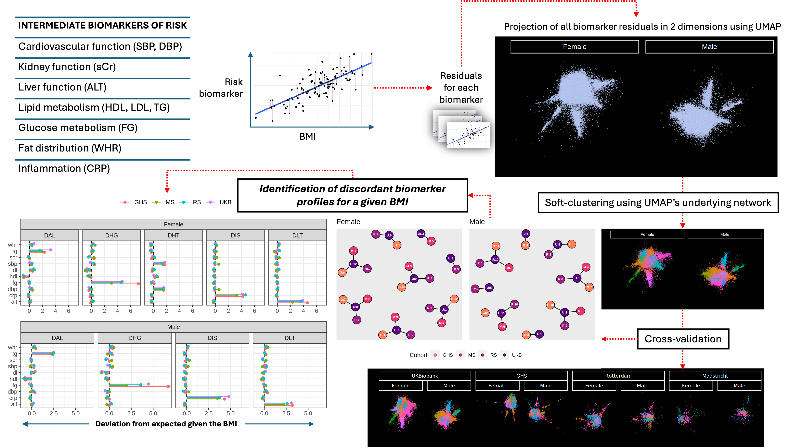
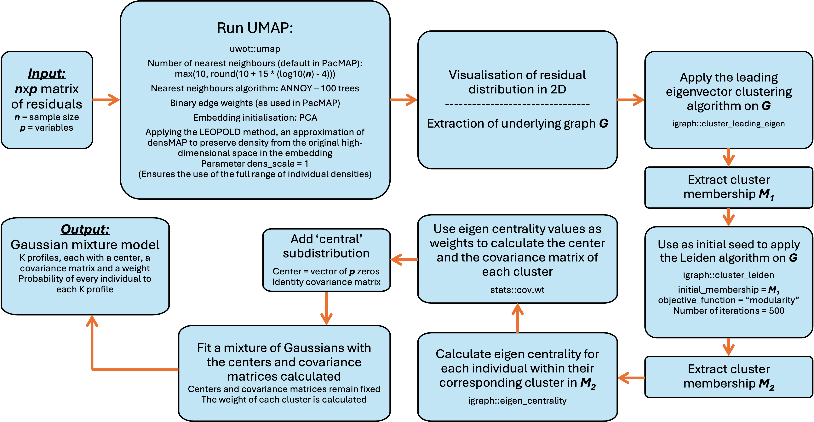

# Profiles of phenotypic discordance for a given BMI

Overall analysis pipeline for discovery and replication:



How we used UMAP for clustering:



## Contents

An overall description of the files in the [scripts](./scripts) folder, which we used to run our analysis is found [here](./scripts_description.md).

## System requirements

We run the analysis in the following R environment:

```{r}
R version 4.3.3 (2024-02-29)
Platform: x86_64-conda-linux-gnu (64-bit)
Running under: Red Hat Enterprise Linux 9.2 (Plow)

Matrix products: default
BLAS/LAPACK: /gpfs/gpfs0/Home/daniel_c/miniforge3/envs/RLang/lib/libopenblasp-r0.3.26.so;  LAPACK version 3.12.0

locale:
 [1] LC_CTYPE=en_US.UTF-8       LC_NUMERIC=C
 [3] LC_TIME=en_US.UTF-8        LC_COLLATE=en_US.UTF-8
 [5] LC_MONETARY=en_US.UTF-8    LC_MESSAGES=en_US.UTF-8
 [7] LC_PAPER=en_US.UTF-8       LC_NAME=C
 [9] LC_ADDRESS=C               LC_TELEPHONE=C
[11] LC_MEASUREMENT=en_US.UTF-8 LC_IDENTIFICATION=C

time zone: Europe/Stockholm
tzcode source: system (glibc)

attached base packages:
[1] stats     graphics  grDevices utils     datasets  methods   base

loaded via a namespace (and not attached):
[1] compiler_4.3.3
```

## Installation guide

To install R follow the instructions found [here](https://www.r-project.org/).

To install the R packages needed for our analysis you can run:

```{r}
Hello
```

On a typical desktop computer this takes around 

## Demo

A demo showing how to run our clustering analysis on a simulated dataset can be found [here](./demo/demo.ipynb). This uses the same functions we used in our analysis. The simulated dataset is derived from the parameters of the profiles we identified, and will have the same format that we used in our original analysis. The parameters of the profiles are stored in the R object [validclusmod.RData](./data/validclusmod.RData).

## Reproduction

Due to data access restrictions, we cannot include the data necessary to reproduce all the quantitative results in the manuscript. However, it is possible to run the same analysis in a new dataset provided it has the same format as we used. The simulated dataset from the demo shows how this should look like. Additionally, see [01_Clustering.Rmd](./scripts/01_Clustering.Rmd) and [06_ValClusOutcomes.Rmd](./scripts/06_ValClusOutcomes.Rmd) for a detailed explanation of the formats expected and the functions used.

---
